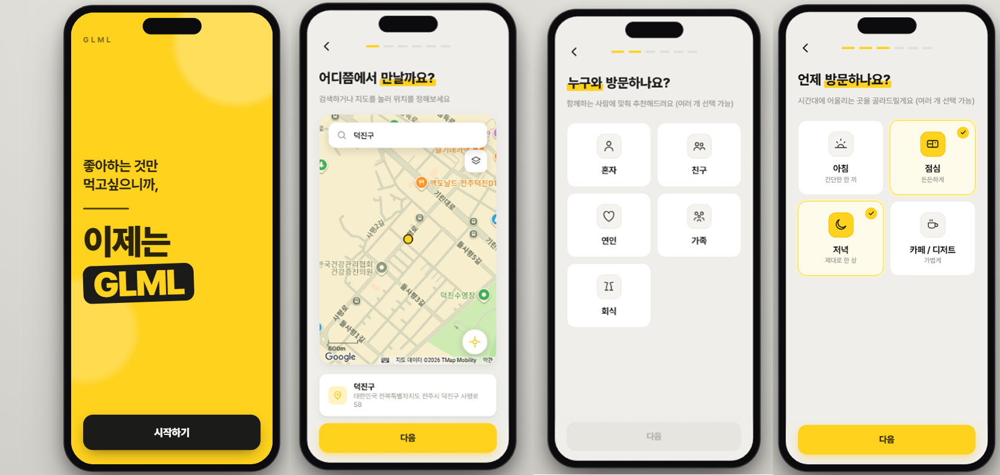
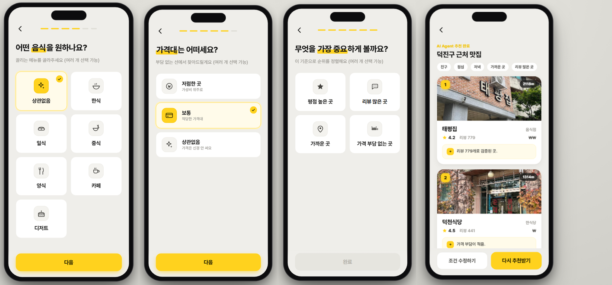

# GLML — 맛집 찾기 AI Agent

> **좋아하는 것만 먹고싶으니까, GLML**
> 13주차 실습 과제 · Agentic Design Pattern 기반 맛집 추천 AI Agent





사용자의 조건(지역·동행·시간대·음식·가격·우선순위)을 분석한 뒤,
**맛집 검색 도구를 직접 호출**하고 그 결과를 **검토(Reflection)** 하여
조건에 맞는 맛집을 추천하는 **Agentic AI** 시스템입니다.

단순히 LLM에게 "맛집 추천해줘"라고 묻는 것이 아니라,
Agent가 **판단(Thought) → 도구 호출(Action) → 결과 확인(Observation) → 검토 → 최종 추천(Final Answer)**
의 흐름으로 동작합니다. 백엔드 ReAct Agent가 이 과정을 **실제로 실행**하고, 프론트엔드가 그 과정을 화면에 시각화합니다.

---

## 🚀 빠른 시작 (Quick Start)

> GitHub에서 클론한 뒤 아래 순서대로 실행하면 됩니다. **Python 3.10+** 와 **Node.js 18+** 가 필요합니다.

### 1. 저장소 클론

```bash
git clone <이-저장소-주소>
cd GLML
```

### 2. 백엔드 준비 (Python / ReAct Agent)

```bash
cd backend
python -m venv .venv

# 가상환경 활성화
#   Windows (PowerShell):  .\.venv\Scripts\Activate.ps1
#   macOS / Linux:         source .venv/bin/activate

pip install -r requirements.txt

# 환경변수 파일 생성 후 OPENAI_API_KEY 입력
#   Windows:  copy .env.example .env
#   macOS/Linux:  cp .env.example .env
cd ..
```

`backend/.env`를 열어 키를 채웁니다. (자세한 키 발급법은 [12. 외부 API 사용 방법](#12-외부-api-사용-방법))

```env
OPENAI_API_KEY=sk-본인_키          # 필수 (없으면 오프라인 모드로 동작)
OPENAI_MODEL=gpt-4o-mini           # 선택 (기본값)
GOOGLE_PLACES_API_KEY=             # 선택 (있으면 실시간 평점·리뷰 데이터)
KAKAO_REST_KEY=                    # 선택 (지역 검증용)
```

### 3. 프론트엔드 준비 (React / UI)

```bash
npm install

# (선택) 지도를 실제로 띄우려면 루트 .env 에 Google Maps 키 입력
#   Windows:  copy .env.example .env   /   macOS·Linux:  cp .env.example .env
```

### 4. 실행 — 두 서버 한 번에

```bash
npm run dev
```

- 프론트엔드(**Vite, :5173**)와 백엔드(**Flask, :8000**)가 **동시에** 실행됩니다. (`concurrently`)
- 브라우저에서 **http://localhost:5173** 접속 → 조건을 고르면 실제 ReAct Agent가 추천을 생성합니다.
- 종료: 터미널에서 **`Ctrl+C`** (둘 다 종료). 안 꺼지면 **`npm run stop`**.
- Windows는 `start.bat`(실행) / `stop.bat`(종료) 더블클릭으로도 됩니다.

> **참고**: 통합 실행 명령 `npm run dev`의 백엔드 경로(`backend\.venv\Scripts\python`)는 Windows 기준입니다.
> macOS/Linux에서는 터미널 두 개로 따로 실행하세요 → [11. 실행 방법](#11-실행-방법) 참고.

> **API 키가 없어도** 백엔드는 `python main.py --offline`로 동일한 도구 파이프라인의 Trace를 생성합니다.

---

## 1. 프로젝트 개요

| 항목 | 내용 |
| --- | --- |
| 프로젝트명 | 맛집 찾기 AI Agent (서비스명: **GLML**) |
| 목적 | 사용자 조건 분석 → 도구 호출 → 결과 검토 → 최종 추천을 수행하는 Agent 구현 |
| 핵심 | 추천 결과보다 **Agent가 생각하고 도구를 쓰고 결과를 개선하는 과정**을 구현 |
| 필수 패턴 | **ReAct Pattern** (Thought → Action → Observation → Final Answer) |
| 추가 패턴 | Plan-and-Solve · Tool Use · Reflection · Memory |

---

## 2. 구현 범위 / 기술 스택

이 프로젝트는 **백엔드(ReAct Agent)** 와 **프론트엔드(UI)** 두 부분으로 구성되며, **실제로 연동**되어 동작합니다.

- **`backend/`** — OpenAI function calling 기반 **ReAct Agent**.
  요청 분석(Plan-and-Solve) → 도구 호출(Tool Use) → 결과 검토(Reflection)로 추천을 생성하고,
  단계별 Trace를 콘솔과 `logs/trace_log.txt`에 출력합니다. ([backend/README.md](backend/README.md))
- **루트(`src/`)** — 같은 흐름을 사용자에게 보여주는 **React 클라이언트 UI**.
  조건을 대화형으로 수집하고, `/api/recommend`로 백엔드를 호출해 **실제 ReAct 실행 과정과 추천 결과**를 화면에 시각화합니다.

| 레이어 | 상태 | 위치 |
| --- | --- | --- |
| ReAct Agent 실행 루프 (ReAct) | ✅ 구현 | `backend/agent.py` (OpenAI function calling) |
| 요청 분석 + 선호 기억 (Plan-and-Solve · Memory) | ✅ 구현 | `backend/agent.py` |
| 맛집 검색/필터/정렬 도구 (Tool Use) | ✅ 구현 | `backend/tools.py` |
| 결과 자체 검토 + 완화 재검색 (Reflection) | ✅ 구현 | `backend/agent.py` |
| 외부 API (Google Places · Kakao Local) | ✅ 연동 | `backend/tools.py` (키 있으면 사용, 실패 시 폴백) |
| 프론트 ↔ 백엔드 연동 (Flask API + Vite 프록시) | ✅ 구현 | `backend/server.py` · `vite.config.ts` |
| 조건 수집 UX / Trace 시각화 (UI) | ✅ 구현 | `src/` (React) |

- **백엔드**: Python · Flask · OpenAI(gpt-4o-mini 기본) · python-dotenv · requests
- **프론트엔드**: React 18 · TypeScript(strict) · Vite 5 · Pretendard
- **맛집 데이터 우선순위**: **Google Places API (New)**(실시간 평점·리뷰·가격) → Kakao Local(지역 검증)+샘플 → `backend/data/restaurants.json` **샘플 데이터셋**.
  (과제 안내의 "외부 API가 어렵다면 샘플 데이터셋 사용 가능"도 폴백으로 충족)
- **API 키 없이도** 백엔드를 `--offline`로 실행해 동일한 도구 파이프라인의 Trace를 생성할 수 있습니다.

---

## 3. 사용자 요청 분석

사용자 입력 문장에서 다음 조건을 추출합니다. (Plan-and-Solve + Memory)

`지역` · `음식 종류` · `방문 목적/동행자` · `시간대` · `가격대` · `리뷰/평점 선호도` · `추천 개수`

### 테스트 입력 분석 예시

> 입력: **"전주 객사 근처에서 친구랑 저녁 먹기 좋은 맛집을 찾아줘. 너무 비싸지 않고, 리뷰가 좋은 곳 위주로 3곳 추천해줘."**

| 조건 | 추출 결과 |
| --- | --- |
| 지역 | 전주 객사 |
| 동행자/목적 | 친구와 저녁 |
| 시간대 | 저녁 |
| 가격대 | 너무 비싸지 않은 곳 (중간 이하) |
| 추천 기준 | 리뷰가 좋은 곳 위주 |
| 추천 개수 | 3곳 |

---

## 4. 맛집 검색 도구 설계 (Tool Use)

Agent가 직접 호출하는 도구 3종을 설계했습니다. LLM이 맛집을 임의 생성하지 않고,
**도구 실행 결과(Observation)를 근거로** 추천하도록 합니다. 도구는 **stateful** 해서
`search` 결과를 내부에 보관하고 `filter`/`rank`가 이를 이어받습니다.

### 4.1 `search_restaurants` — 맛집 검색

지역·음식 종류·가격대 조건으로 맛집 후보를 검색합니다. (Google Places → Kakao+샘플 → 샘플 폴백)

```jsonc
// 입력
{ "location": "전주 객사", "category": "상관없음", "price_level": "중간", "min_review_score": 4.0, "limit": 10 }

// 출력(status: ok | empty | no_region)
{ "status": "ok", "count": 10, "results": [
  { "name": "몽유도", "category": "숯불구이/바베큐전문점", "rating": 4.7, "review_count": 105, "price_level": "중간", "distance_m": 451 }
  // ...
] }
```

### 4.2 `filter_restaurants` — 맛집 필터링

직전 검색 후보 중 사용자 조건에 맞는 식당만 남깁니다. (평점·리뷰 수·가격 상한·거리)

```jsonc
{ "min_rating": 4.0, "min_review_count": 100, "max_price_level": "중간", "max_distance_m": 1000 }
```

### 4.3 `rank_restaurants` — 맛집 정렬

필터링된 후보를 추천 우선순위로 정렬하고 상위 N개를 선정합니다.

```jsonc
{ "sort_by": ["rating", "review_count", "distance"], "top_k": 3 }
```

> 가격대 순서: `저렴 < 중간 이하 < 중간 < 비쌈`. "너무 비싸지 않게" = `max_price_level='중간'`(비쌈 제외).
> 도구의 입출력 스키마(OpenAI function schema)는 `backend/tools.py`의 `TOOL_SCHEMAS`에 정의되어 있습니다.

---

## 5. 적용한 Agentic Design Pattern

수업에서 배운 패턴 중 **5개**를 적용했습니다. (ReAct 필수 포함 · 자세한 설명은 [backend/README.md](backend/README.md))

### 5.1 ReAct Pattern *(필수)*

`Thought → Action → Observation` 루프를 반복하다 조건을 만족하면 `Final Answer`를 생성합니다.
구현: `backend/agent.py`의 `_run_llm` — OpenAI function calling 루프(최대 6턴). 매 턴 LLM이 한국어 Thought를 적고 도구를 호출하면, 그 결과를 Observation으로 다시 LLM에 전달합니다.

### 5.2 Plan-and-Solve Pattern

사용자 요청을 **조건(JSON) + 처리 단계**로 분해합니다.
`요청 분석 → 지역 추출 → 음식·조건 파악 → 후보 검색 → 기준별 필터링 → 우선순위 정렬 → 검토 → 최종 답변`
구현: `_plan_and_extract`.

### 5.3 Tool Use Pattern

Agent가 `search_restaurants` · `filter_restaurants` · `rank_restaurants`를 **직접 호출**합니다. (4장 참조)

### 5.4 Reflection Pattern

최종 추천 전, 결과가 조건에 맞는지 스스로 검토하고 부족하면 보완합니다.
구현: `_reflect_and_recover`(후보 부족 시 기준 완화 후 재필터·재정렬) + `_reflect_llm`(5개 기준 자체 점검).
검토 기준: ① 지역 일치 ② 가격 과하지 않음 ③ 리뷰·평점 충분 ④ 목적/동행 적합 ⑤ 추천 개수 충족.

### 5.5 Memory Pattern

추출한 사용자 선호(지역·동행·가격대·리뷰·개수)를 `self.memory`에 저장하고, 이후 도구 호출과 Reflection에 재사용합니다.

> 프론트엔드도 같은 흐름을 구현합니다: `App.tsx`의 단계 머신(위치→동행→시간→음식→가격→우선순위)이 Plan-and-Solve/Memory를,
> `src/pages/AgentTracePage.tsx`가 ReAct Trace 시각화를 담당합니다.

---

## 6. ReAct Agent 실행 루프

```
1. 사용자 입력 수신
2. 요청 분석 (Plan-and-Solve)      ─ 조건(JSON) + 처리 단계로 분해, Memory에 저장
3. 필요한 도구 선택 (Thought → Action)
4. 도구 실행 → Observation 수신
5. 결과가 조건에 맞는지 판단 (Thought)
6. 필요 시 추가 도구 호출 / 조건 완화 재검색 (3~5 반복)
7. Reflection — 조건 충족 여부 자체 검토 + 부족 시 보완
8. 최종 추천 답변 생성 (Final Answer)
```

---

## 7. 실행 테스트 시나리오 & Trace

**입력 프롬프트**

```
전주 객사 근처에서 친구랑 저녁 먹기 좋은 맛집을 찾아줘.
너무 비싸지 않고, 리뷰가 좋은 곳 위주로 3곳 추천해줘.
```

**실제 실행 Trace (요약)** — 전체 로그: [`backend/logs/trace_log.txt`](backend/logs/trace_log.txt)

```
[User Input] 전주 객사 근처에서 친구랑 저녁 먹기 좋은 맛집을 찾아줘 …

[Plan-and-Solve] region=전주 객사 · companion=친구와 저녁 · max_price_level=중간 이하 · count=3
[Plan] ① 요청 분석 ② 지역 추출 ③ 조건 파악 ④ 검색 ⑤ 필터링 ⑥ 정렬 ⑦ 검토·최종

🧠 Thought   먼저 맛집을 검색한다. 음식=상관없음, 가격=중간 이하로 설정.
🛠  Action    search_restaurants  {"location":"전주 객사","category":"상관없음","price_level":"중간 이하","min_review_score":4.0}
👁  Observation status=empty · 조건에 맞는 후보가 없습니다. 완화해 다시 검색하세요.   ← 예외(검색 0건) 인지

🧠 Thought   결과가 없으니 가격 조건을 완화해 다시 검색한다.                          ← Observation 기반 대안 제시
🛠  Action    search_restaurants  {"location":"전주 객사","price_level":"상관없음", …}
👁  Observation status=ok · Google Places API에서 실시간 데이터를 가져왔습니다. (후보 10곳)

🛠  Action    filter_restaurants  {"min_rating":4.0,"min_review_count":100,"max_price_level":"중간"}
👁  Observation status=ok · 후보 1곳
🛠  Action    rank_restaurants    {"sort_by":["rating","review_count","distance"],"top_k":3}
👁  Observation status=ok · 1곳

🔁 보완   추천 후보가 1곳뿐 → 기준을 완화해 다시 필터링한다. (Reflection 보완)
👁  Observation filter → 5곳 · rank → 상위 3곳

🔍 Reflection  만족: 예  (region ✓ price ✓ review ✓ fit ✓ count ✓)

[Final Answer]
1. 초로초로 (일본 음식점)  ★5.0 · 리뷰 68 · ₩₩ · 470m
2. 화녕 객리단길본점 (음식점) ★4.9 · 리뷰 70 · ₩₩ · 574m
3. 오일내 객사점 (한식당)   ★4.8 · 리뷰 85 · ₩₩ · 82m
```

> 이 실행 로그는 **예외 처리가 실제로 작동**한 사례입니다. 첫 검색이 0건(`empty`)이자
> Agent가 그 Observation을 보고 **가격 조건을 스스로 완화해 재검색**했고, 결과가 1곳뿐이자
> Reflection이 **기준을 다시 완화**해 3곳을 확보했습니다. (Google Places **실시간 데이터** 사용)

> 화면에서 보기: `npm run dev` 실행 후 조건 선택 → 트레이스 화면이 흐른 뒤 추천 결과 표시.
> 단계 점프는 `?step=7`(트레이스) → `?step=8`(결과).

---

## 8. 예외 처리 설계

오류를 그대로 출력하지 않고, **Agent가 Observation으로 에러를 받은 뒤 대안을 제시**하도록 설계합니다.

| 상황 | 처리 방식 |
| --- | --- |
| 존재하지 않는 지역 입력 | 검색이 `status=no_region` 반환 → Agent가 지역명 재확인/대표 장소 입력 안내 |
| 검색 결과가 없는 경우 | `status=empty` → 음식·가격 조건을 완화해 재검색 (7장 Trace에서 실제 발생) |
| 음식 종류가 모호한 경우 | `category='상관없음'`으로 식사류 전체 검색 |
| API 호출 실패 | 오류 노출 대신 **샘플 데이터셋으로 자동 폴백**, Observation에 사용 사실 명시 |
| 조건이 부족한 경우 | 기본값 적용 (필터 평점 4.0·리뷰 100, 정렬 [rating, review_count, distance], 3곳) |

---

## 9. 프로젝트 구조

```
GLML/
├── backend/                    # ── ReAct Agent (Python) ──
│   ├── main.py                 # CLI 진입점 (python main.py [프롬프트])
│   ├── server.py               # Flask API 서버 (프론트 연동, POST /api/recommend)
│   ├── agent.py                # Plan-and-Solve → ReAct → Reflection + 오프라인 모드
│   ├── tools.py                # 도구 3종 + OpenAI function 스키마 + Google/Kakao 폴백
│   ├── data/restaurants.json   # 전주 객사 샘플 맛집 데이터셋
│   ├── logs/trace_log.txt      # 실행 시 자동 생성되는 Trace
│   ├── requirements.txt
│   └── .env.example            # OPENAI / GOOGLE_PLACES / KAKAO 키 템플릿
│
├── index.html                  # ── React UI ──  폰 목업 프레임 + #root
├── package.json                # 스크립트: dev(통합)·dev:web·dev:api·stop·build
├── vite.config.ts              # /api → localhost:8000 프록시
├── start.bat · stop.bat        # (Windows) 더블클릭 실행/종료
├── scripts/stop.ps1            # 포트(5173/8000) 강제 종료
├── docs/                       # README용 스크린샷 (preview-1·2.png)
├── .env.example                # VITE_GOOGLE_MAPS_API_KEY 템플릿
└── src/
    ├── main.tsx · App.tsx      # 엔트리 + 단계 머신(라우팅) + 조건 상태(Memory)
    ├── api.ts                  # 백엔드 /api/recommend 호출
    ├── globals.css · types.ts · util/deviceFit.ts
    ├── data/                   # options / restaurants / trace
    ├── components/             # Icons · TopBar · Head · Opt · SelectScreen · FauxMap
    └── pages/                  # StartPage · LocationSearchPage · AgentTracePage · ResultPage
```

---

## 10. 화면 흐름 (프론트엔드)

`시작 → 위치 선택 → 동행 → 시간대 → 음식 종류 → 가격대 → 우선순위 → ReAct Trace → 추천 결과`

- 조건 수집 단계는 Plan-and-Solve의 분해 단계를, 단계 간 상태 유지는 Memory를 시각적으로 보여줍니다.
- Trace 화면(`AgentTracePage`)에서 Thought/Action/Observation이 순차적으로 흐른 뒤 결과 화면으로 전환됩니다.
- 백엔드를 켜지 않으면 trace 화면에 안내 후 목업 결과로 폴백합니다.

---

## 11. 실행 방법

### ⭐ 통합 실행 (권장, Windows)

```bash
npm run dev          # 프론트(5173) + 백엔드(8000) 동시 실행 (concurrently)
# 종료: 터미널에서 Ctrl+C  /  안 꺼지면: npm run stop
```

> Windows에서는 `start.bat` / `stop.bat` 더블클릭으로도 실행·종료할 수 있습니다.
> 통합 명령은 `package.json`의 `dev:api`가 `backend\.venv\Scripts\python`를 호출하므로 **Windows 경로 기준**입니다.

### 터미널 2개로 분리 실행 (macOS/Linux 또는 디버깅용)

**터미널 1 — 백엔드 API 서버**
```bash
cd backend
source .venv/bin/activate     # Windows: .\.venv\Scripts\Activate.ps1
python server.py              # http://localhost:8000
```

**터미널 2 — 프론트엔드**
```bash
npm run dev:web               # http://localhost:5173 (vite 단독)
```

### 백엔드만 단독 실행 (CLI)

```bash
cd backend
python main.py                # 기본 테스트 프롬프트 실행 (Trace → logs/trace_log.txt)
python main.py "서울 홍대 파스타 맛집 2곳 추천해줘"   # 직접 입력
python main.py --offline      # API 키 없이 동일 파이프라인으로 Trace 생성
```

### 프론트엔드 빌드

```bash
npm run build    # 타입체크(tsc) + 프로덕션 빌드 → dist/
npm run preview  # 빌드 결과 미리보기
```

### 디버그용 쿼리 파라미터

| 파라미터 | 설명 |
| --- | --- |
| `?step=N` | 특정 단계부터 시작 (0 시작 ~ 8 결과). 2 이상이면 조건을 미리 채움 |
| `?fx=0` | 모든 애니메이션 비활성화 |

예) `http://localhost:5173/?step=8` → 추천 결과 화면 바로 보기

---

## 12. 외부 API 사용 방법

> 키는 모두 `.env`에 보관하며 **git/제출물에서 제외**됩니다(`.gitignore` 포함).
> 백엔드 키는 `backend/.env`, 프론트 지도 키는 **루트 `.env`** 에 둡니다.

### LLM — OpenAI (필수)

1. [OpenAI Platform](https://platform.openai.com/api-keys)에서 **API 키** 발급
2. `backend/.env`에 입력
   ```env
   OPENAI_API_KEY=sk-본인_키
   OPENAI_MODEL=gpt-4o-mini        # (선택) 기본값
   ```
3. `agent.py`가 이 키로 ReAct 추론 + function calling(도구 호출)을 수행합니다.
   키가 없으면 자동으로 **오프라인 시뮬레이션**(휴리스틱)으로 동일 파이프라인을 실행합니다.

### 맛집 데이터 — Google Places API (New) · 권장

평점·리뷰 수·가격대를 **실제로** 제공하는 공식 API입니다. (7장 Trace가 이 데이터로 동작)

1. [Google Cloud Console](https://console.cloud.google.com) → 프로젝트 생성
2. **"Places API (New)"** 사용 설정 + **결제수단(빌링) 등록**
3. **API 키** 발급 → `backend/.env`에 입력
   ```env
   GOOGLE_PLACES_API_KEY=발급받은_API_키
   ```
4. `search_restaurants`가 `places:searchText`로 후보를 받아 `rating`/`userRatingCount`/`priceLevel`을 사용하고,
   거리(`distance_m`)는 좌표로 계산합니다. 실패(키·빌링·할당량) 시 **샘플 데이터셋으로 자동 폴백**.

### 맛집 데이터 — Kakao Local (대안)

`KAKAO_REST_KEY`만 있으면 키워드 검색으로 지역/장소 실재 여부를 검증합니다. 단, **평점·리뷰·가격은 제공하지 않아**
상세 속성은 샘플로 보강됩니다(실데이터가 필요하면 Google Places 사용).

> 우선순위: **Google Places → Kakao+샘플 → 샘플**. 키가 없으면 자동으로 다음 단계로 폴백합니다.

### 지도 — Google Maps JavaScript API (프론트엔드, 선택)

위치 선택 화면에 **실제 Google 지도**를 띄웁니다.

1. [Google Cloud Console](https://console.cloud.google.com)에서 **"Maps JavaScript API"** 사용 설정
   (맛집 데이터용 "Places API (New)"와는 **별개**로 켜야 합니다)
2. **루트 `.env`** 에 키 입력 후 `npm run dev` **재시작**
   ```env
   VITE_GOOGLE_MAPS_API_KEY=발급받은_키
   ```
3. 키가 없거나 인증 실패 시 → 장식용 지도(placeholder)로 자동 폴백합니다.

> ⚠️ **보안**: 이 키는 브라우저에 노출됩니다. 가급적 **'Maps JavaScript API'만 허용 + HTTP 리퍼러 제한**을 건 별도 키를 사용하세요.

---

## 13. 제출 항목 체크리스트

- [x] 소스 코드 (`backend/` Agent + `src/` UI)
- [x] 실행 환경 정리 파일 (`backend/requirements.txt` · `package.json`)
- [x] `README.md` (루트 + [`backend/README.md`](backend/README.md))
- [x] Agentic Design Pattern 설명 (5장 · backend/README §4)
- [x] ReAct Agent 도구 호출 Trace (7장 · `backend/logs/trace_log.txt`)
- [x] 실행 로그 (`backend/logs/trace_log.txt` 자동 생성)
- [x] 외부 API 사용 방법 (12장 · backend/README §6)

**제출 시 제외**: `.venv`, `__pycache__`, `node_modules`, `dist`, API 키가 담긴 `.env`
**제출 형식**: `[이름]_[학번]_실습4.zip` (또는 GitHub 공개 repo 주소 `.txt`)
**마감**: 6월 10일(화) 23:59

---

## 14. 구현 상태

- ✅ **백엔드**: OpenAI 기반 ReAct 실행 루프, Plan-and-Solve 조건 추출, Memory, 도구 3종(Tool Use),
  Reflection(완화 재검색), 5가지 예외 처리, Google Places/Kakao 연동 + 샘플 폴백, Trace 로그 자동 저장, 오프라인 모드
- ✅ **프론트엔드**: 조건 수집 UX, ReAct Trace 시각화, 추천 결과 화면
- ✅ **연동**: Flask API(`/api/recommend`) + Vite 프록시로 프론트 ↔ 백엔드 실시간 연결

> 이번 과제의 핵심은 추천 자체보다 **Agent가 생각하고 도구를 사용하며 결과를 개선하는 과정**을 구현하는 것이며,
> 본 프로젝트는 그 흐름(Plan → ReAct(Thought/Action/Observation) → Reflection → Final Answer)을
> 백엔드 Agent로 실제 실행하고, 프론트엔드로 시각화합니다.
